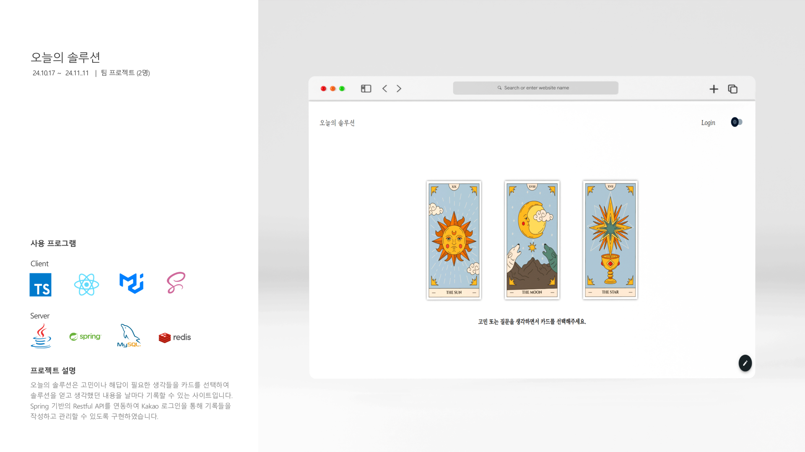
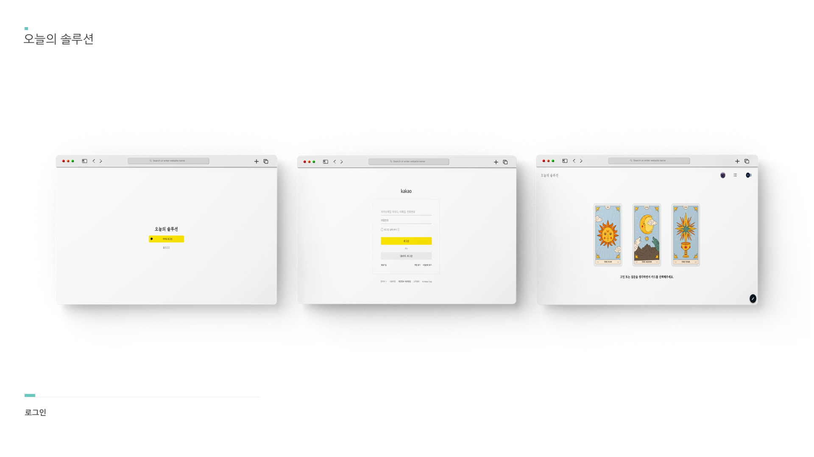
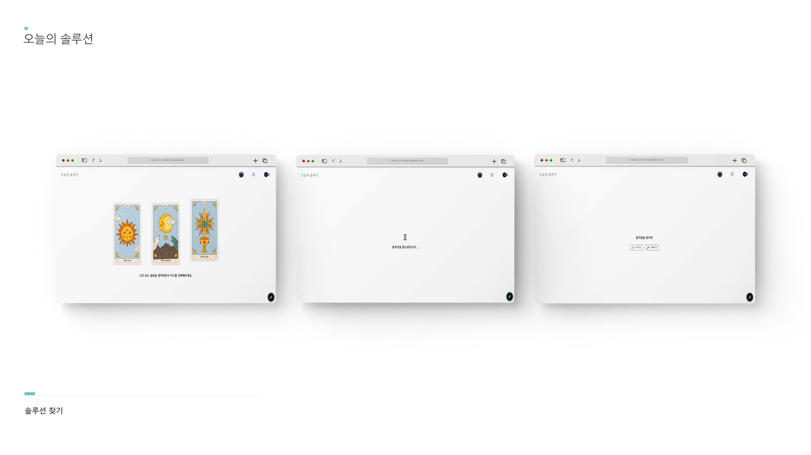
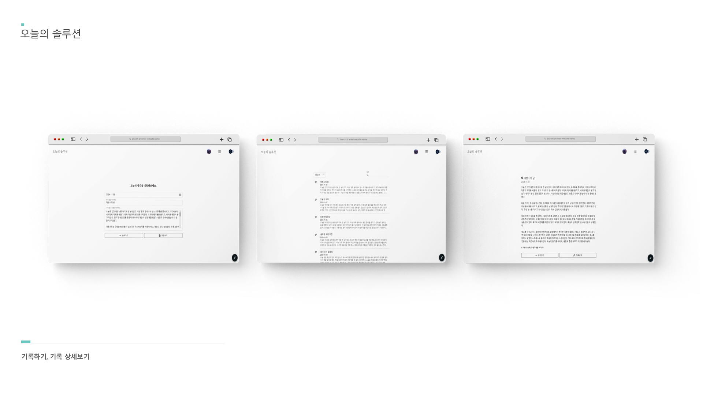
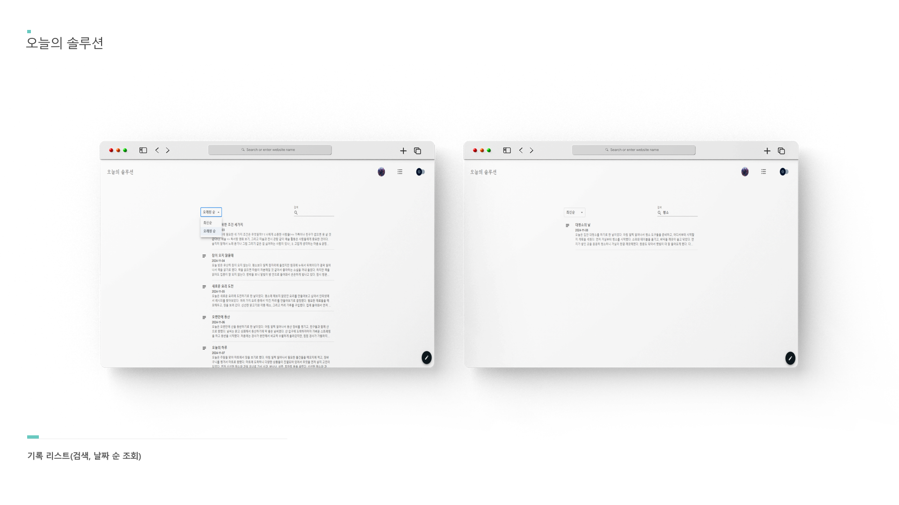
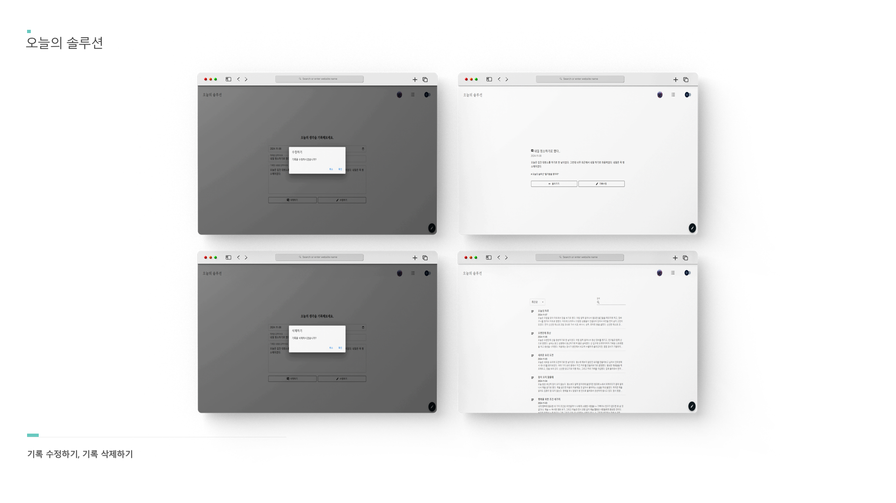

# 오늘의 솔루션

### 🔗사이트로 이동

➡️ https://web-today-solution-m2zjn84xd00fa3a3.sel4.cloudtype.app/

<br>

### 🛠️ 구현기술 요약

✅ Vite를 통한 개발환경 구성과 TypeScript기반 타입정의

✅ React18 Router ver6 기반 컴포넌트 UI 구축 및 데이터 상태관리

✅ 데이터 통신을 위한 Axios 연동과 Spring Boot 기반 RESTful API 서버 구축

✅ Spring Security와 Redis를 통한 사용자 인증처리 및 JWT 유효성 관리

<br>

## 🪄 Install

```sh
npm install
```

```sh
npm run dev
```

### Environment variables

```sh
#default
VITE_BASE_URL

#Kakao Login
VITE_REST_API_KEY
VITE_REDIRECT_URL
```

### Requirements
```sh
node 16+ ~ or v18.20.1
typescript v5.6.3
```

<br>







